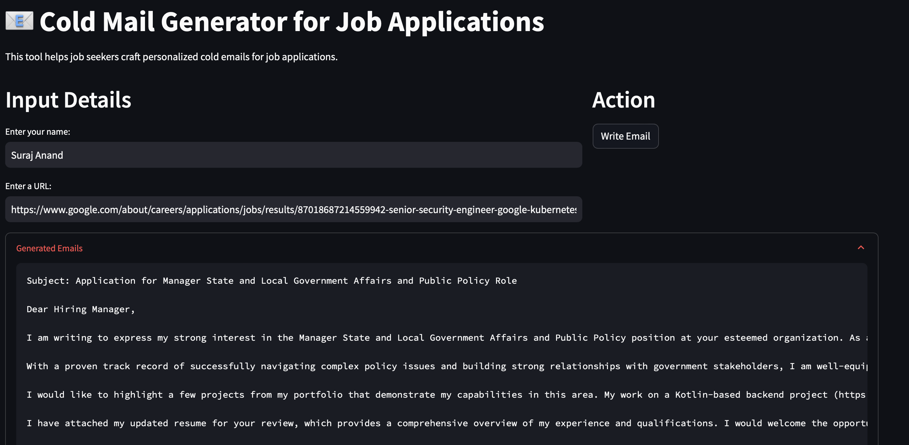
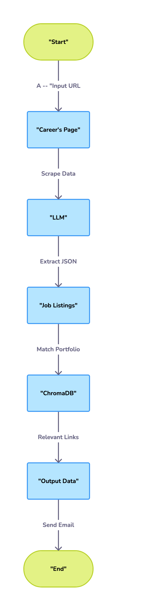

# AI-Powered Cold Email Generator for Job Applications

This project is an advanced AI-based cold email generator designed to assist job seekers by crafting personalized, impactful emails for job applications. Leveraging cutting-edge technologies such as Llama3.1 LLM, LangChain, ChromaDB, and Streamlit, this tool streamlines the process of creating professional cold emails tailored to job listings and candidate profiles.

## Features

The AI-Powered Cold Email Generator allows job seekers to:
- Input the URL of a company's careers page.
- Automatically extract job listings from that page.
- Generate personalized cold emails highlighting your skills and experiences.
- Include relevant project portfolio links based on job descriptions, giving you an edge in your application.



## How It Works

1. The user inputs their name and the URL of a company’s careers page.
2. The **LLM** scrapes the page, extracts job listings, and structures them in a JSON format, including the following fields:
   - Job Title
   - Skills
   - Experience
   - Job Description
3. The system queries a **vector database** (ChromaDB) to match relevant portfolio links with the job description.
4. The **LLM** generates a personalized cold email based on the extracted job data and matched portfolio links.
5. The user receives a ready-to-send email, tailored to their skills and the job listing.

## Architecture Overview



The system architecture is divided into several components that work together to achieve the final output:

1. **Career’s Page**:
   - The user provides a URL to the company's careers page.
   - The **LLM** (Large Language Model) scrapes and extracts job listings from the webpage.

2. **Job Data Extraction**:
   - The extracted jobs are structured in JSON format, with fields such as:
     - **Job Title**
     - **Skills**
     - **Experience**
     - **Job Description**

3. **Vector Store (ChromaDB)**:
   - The system compares the job descriptions with relevant portfolio links from a **vector store**, providing personalized content for the email.
   
4. **Cold Email Generation**:
   - The **LLM** generates a personalized cold email, tailored to the job listing and the user's portfolio.

## Set-up

### 1. Install Dependencies

Before getting started, install the dependencies:

```bash
pip install -r requirements.txt
```

### 2. Create `.env` File

To get started, create a `.env` file in the app directory. You will need to include your API key for the LLM and other services used in the app.

```bash
GROQ_API_KEY=<your_api_key_here>
```

### 3. Run the Streamlit App

You can launch the application by running the following command:

```bash
streamlit run main.py
```

## Technologies Used
- **Llama 3.1 LLM**: The large language model used for understanding and generating text.
- **LangChain**: Used for building the chain of language model prompts and responses.
- **ChromaDB**: A vector database used to store and retrieve relevant portfolio links.
- **Streamlit**: The front-end framework used to create the interactive user interface.

## Contributing

Contributions are welcome! Please feel free to submit a Pull Request or open an Issue for any enhancements or bug fixes.

## License

This project is licensed under the MIT License.
